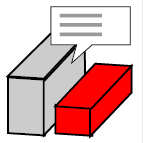

# Real Estate Optimizer for SketchUp

A powerful SketchUp plugin that bridges masterplan design with real estate financial decision-making through real-time optimization and analysis.

## Features

- **Real-time Financial Analysis**

  - Automatic cashflow calculation as you design
  - Dynamic KPI updates with every design change
  - Instant IRR, NPV, and MOIC calculations

- **Masterplan Optimization**

  - Building layout optimization
  - Property line analysis
  - Customer overlap calculation
  - North-South orientation optimization

- **Chinese Market Specifics**
  - Supervision fund management
  - VAT and corporate tax calculations
  - Land payment scheduling
  - Construction cost allocation

## Usage

1. Copy all plugin files to:

   - Windows: `C:\Users\[Username]\AppData\Roaming\SketchUp\SketchUp 2021\SketchUp\Plugins`
   - Mac: `~/Library/Application Support/SketchUp 2021/SketchUp/Plugins`

2. Launch SketchUp - the toolbar will appear automatically with these tools:

 **Project Input**

- Configure project parameters
- Set financial assumptions

 **Property Line Tool**

- Define property boundaries
- Set setback requirements

 **Apartment Manager**

- Define unit types and pricing
- Set customer overlap ratios

 **Building Manager**

- Create and edit building types
- Set construction costs and schedules

 **Insert Building**

- Place buildings in the model
- Adjust building positions

 **Building Attributes**

- Edit building properties
- Modify unit mix

 **Optimization Panel**

- Configure optimization parameters
- Run layout optimization
- View real-time KPIs

 **Output Panel**

- View detailed cashflow reports
- Export financial analysis
- Generate project summaries

## Copyright

© 2024 Richard Qian Li. All rights reserved.  
Contact: ludwig.peking@gmail.com
WeChat: ludwigpeking

---

# SketchUp 房地产优化插件

一款强大的 SketchUp 插件，将总体规划设计与房地产投资决策紧密结合，提供实时优化与分析。

## 功能特点

- **实时财务分析**

  - 设计方案变更时自动计算现金流
  - 动态更新关键业绩指标
  - 即时计算内部收益率、净现值和投资回报倍数

- **总体规划优化**

  - 建筑布局优化
  - 红线分析
  - 客户重叠度计算
  - 南北向优化

- **中国市场特色**
  - 监管资金管理
  - 增值税和所得税计算
  - 土地支付计划
  - 建设成本分配

## 使用方法

1. 将插件文件复制至：

   - Windows 系统：`C:\Users\[用户名]\AppData\Roaming\SketchUp\SketchUp 2021\SketchUp\Plugins`
   - Mac 系统：`~/Library/Application Support/SketchUp 2021/SketchUp/Plugins`

2. 启动 SketchUp - 工具栏将自动显示以下工具：

 **项目输入**

- 配置项目参数
- 设置财务假设

 **红线工具**

- 定义地块边界
- 设置退线要求

 **户型管理器**

- 定义户型和定价
- 设置客户重叠率

 **建筑管理器**

- 创建和编辑建筑类型
- 设置建设成本和进度

 **插入建筑**

- 在模型中放置建筑
- 调整建筑位置

 **建筑属性**

- 编辑建筑属性
- 修改户型组合

 **优化面板**

- 配置优化参数
- 运行布局优化
- 查看实时关键指标

 **输出面板**

- 查看详细现金流报告
- 导出财务分析
- 生成项目总结

## 版权声明

© 2024 李谦。保留所有权利。  
联系方式：ludwig.peking@gmail.com
商业合作: WeChat: ludwigpeking
